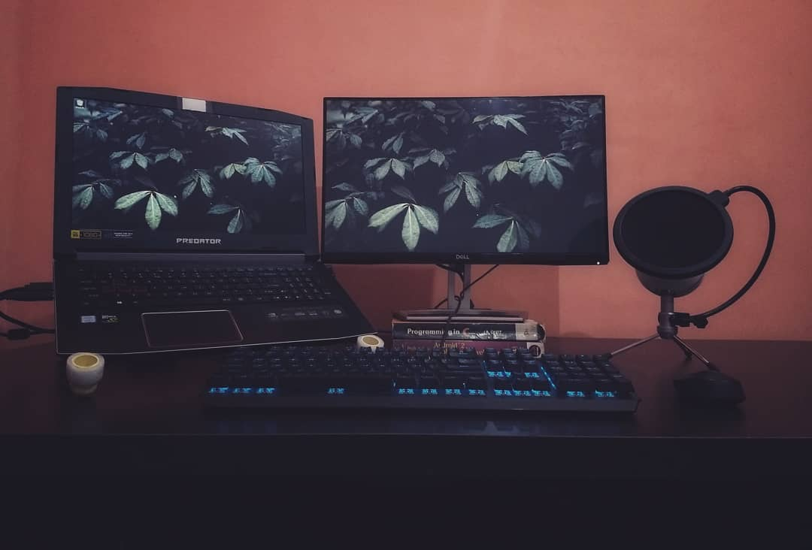

All the pieces I've added to my setup contributes in fullfilling my dream of having a setup of my own. Built over the years enhancing my productivity and helping me build products with nothing holding me back.

## Hardware

### Acer Predator Helios 300

I have the 2018's model, it comes following specs, switched to it in Nov 2018 after using HP 15-r005TX for four years.

-  GPU - NVIDIA GeForce GTX 1060 6GB
-  CPU - Core i5 8th Gen
-  RAM - 16GB DDR4
-  SSD - 126GB
-  Hard Drive - 1TB
-  OS - Windows 10 Home Edition

### Mouse & Keyboards

-  Mouse - Logitech G102
-  Mechanincal - A Redragon Varuna K559 RGB
-  Wireless - Logitech K380

### Monitor

-  Dell S2218H - a 21.5" LED Monitor

### Headphones

-  Sennhesiser HD 4.40-BT

### Phone

-  Moto G5 Plus

## Softwares

### Editor

-  VS Code - [Download](https://code.visualstudio.com/download 'Download')
-  Theme - [Night Owl](https://github.com/sdras/night-owl-vscode-theme 'Night Owl')

### Browsers

-  Google Chrome
-  Brave
-  Extensions - [React Dev Tools](https://chrome.google.com/webstore/detail/react-developer-tools/fmkadmapgofadopljbjfkapdkoienihi?hl=en 'React Dev Tools'), [Apollo Dev Tools](https://chrome.google.com/webstore/detail/apollo-client-developer-t/jdkknkkbebbapilgoeccciglkfbmbnfm?hl=en 'Apollo Dev Tools'), [CSS Peeper](https://chrome.google.com/webstore/detail/css-peeper/mbnbehikldjhnfehhnaidhjhoofhpehk?hl=en 'CSS Peeper')

### Terminal

-  Hyper - [Download](https://hyper.is/ 'Download')
-  Bash

### Video Editing & Screen Recording

-  Recording - [Stream Labs](https://streamlabs.com/ 'Stream Labs')
-  Editing - Magix Movie Maker/Adobe Premiere/After Effects
-  Audio - Blue Snowball

### Design

-  Figma - [Download](https://www.figma.com/ 'Download')
-  Photoshop

### Productivity Tools

-  Notion - [Download](https://www.notion.so/ 'Download')
-  Google Keep

### Music

-  Streaming - Spotify
